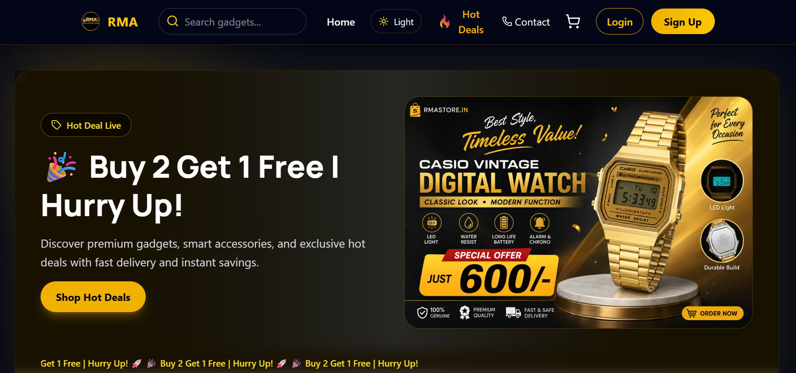

<div align="center">

# Hi 👋, I'm Sagar Sharma


<br>

<p align="center">
  
  
  
  
</p>

### 🚀 Turning Ideas into Scalable Software Solutions

</div>

---

# 💫 About Me

```yaml
Name: Sagar Sharma

Education:
  B.Tech Computer Science Engineering

Location:
  Bhopal, India 🇮🇳

Currently Working On:
  - Full Stack Web Applications
  - AI & Machine Learning Projects

Currently Learning:
  - Artificial Intelligence
  - Machine Learning
  - Python for AI
  - Advanced Backend Engineering
  - System Design

Looking to Collaborate:
  - Open Source
  - AI/ML Projects
  - MERN Stack Projects
  - Innovative Startup Ideas

Ask Me About:
  - React.js
  - Node.js
  - Express.js
  - MongoDB
  - Java
  - Spring Boot
  - REST APIs

Fun Fact:
  "I enjoy transforming ideas into real-world software."
```

---

# 🚀 Tech Stack

### 💻 Languages

<p>

</p>

### 🎨 Frontend

<p>

</p>

### ⚙️ Backend

<p>

</p>

### ☁️ Cloud & Tools

<p>

</p>

### 🤖 AI / ML (Learning)

<p>

</p>

---

## 💼 Freelance Work

I have worked on and delivered production-ready web applications for clients, focusing on responsive UI, scalable backend APIs, database integration, authentication, and deployment.

### 🛒 RMA Store — Custom E-Commerce Platform

<a href="https://www.rmastore.in/">
  
</a>

**RMA Store** is a fully customized e-commerce platform developed for a client, featuring product management, shopping cart, checkout, online payments, admin controls, and responsive UI.

**Key Features**
- 🛍️ Product browsing and management
- 🛒 Shopping cart and checkout
- 💳 Online payment integration with Razorpay
- 🖼️ Cloudinary-based image management
- 👨‍💼 Admin product management
- 📱 Responsive design for desktop and mobile
- 🧪 Jest-based testing for key functionality

**Tech Stack:**  
`React.js` `Node.js` `Express.js` `MongoDB` `Mongoose` `Tailwind CSS` `Razorpay` `Cloudinary` `Jest`

🔗 **[Live Website →](YOUR_RMA_STORE_LINK)**

---

### 💼 RafflesJobs — Recruitment Platform

<a href="YOUR_RAFFLESJOBS_LINK">
  
</a>

**RafflesJobs** is a recruitment platform developed for a consultancy to manage job listings and candidate profiles through a centralized web application.

**Key Features**
- 👥 Candidate profile management
- 🔎 Advanced candidate search
- 📄 Resume upload and management
- 🔐 Google OAuth authentication
- 💼 Job listing and recruitment workflows
- ☁️ Cloud-based file management
- 📱 Fully responsive interface

**Tech Stack:**  
`Next.js` `React.js` `Node.js` `Express.js` `MongoDB` `Google OAuth` `Cloudinary`

🔗 **[Live Website →](YOUR_RAFFLESJOBS_LINK)**

---

### 🌾 AgriAssure — Contract Farming Platform

<a href="YOUR_AGRIASSURE_LINK">
  
</a>

**AgriAssure** is a MERN-based contract farming platform connecting farmers and buyers through digital contracts, negotiation, escrow payments, marketplace listings, and delivery tracking.

**Key Features**
- 🤝 Farmer–buyer contract management
- 💰 Escrow-based payment workflow
- 💳 Razorpay payment integration
- 🌾 Crop marketplace
- 📊 Mandi rate information
- 📑 Digital contract and signature workflow
- 👨‍🌾 Farmer, buyer, and admin dashboards
- 🤖 AI-powered agricultural chatbot

**Tech Stack:**  
`React.js` `Node.js` `Express.js` `MongoDB` `Razorpay` `Cloudinary` `Gemini API` `Tailwind CSS`

🔗 **[Live Project →](YOUR_AGRIASSURE_LINK)**

---

### 📌 Freelance Experience

**6+ months of freelance development experience**

- Delivered **production-ready client applications** from development to deployment.
- Worked across frontend, backend, database, authentication, APIs, cloud storage, and payments.
- Collaborated with clients to understand requirements and implement customized features.
- Deployed applications using **Vercel, Render, MongoDB Atlas, and Cloudinary**.

# 🔥 GitHub Streak

<p align="center">


</p>

---

# 📈 Contribution Graph


---

# 🌟 Featured Projects

## 🌾 AgriAssure

> Smart Contract Farming Platform built using MERN Stack

✨ Features

- Secure Contract Management
- Farmer & Buyer Dashboards
- Marketplace
- Escrow Payment Flow
- Role-Based Authentication
- Responsive UI
- Modern Dashboard

---

## 🛒 RMA Store

Modern E-Commerce Platform

✨ Features

- Authentication
- Product Management
- Admin Dashboard
- Razorpay Integration
- Order Tracking
- Cloudinary Storage
- Responsive Design

---

## 🤖 AI Projects

Currently building projects involving

- Machine Learning
- Data Analysis
- Prediction Models
- Intelligent Web Applications

---

# 💻 Competitive Programming

<p align="center">

<a href="https://leetcode.com/u/Sagarsharma2003/">

</a>

<a href="YOUR_CODEFORCES">

</a>

<a href="YOUR_CODECHEF">

</a>

<a href="YOUR_GFG">

</a>

</p>

---

# 🎯 2026 Goals

- 🚀 Become an SDE-1
- 🌱 Master AI & Machine Learning
- ⚡ Contribute to Open Source
- 📚 Learn System Design
- 💯 Solve 700+ DSA Problems
- ☁️ Build Production-Ready Applications
- 🤝 Collaborate with Developers Worldwide

---

# 🤝 Connect With Me

<p align="center">

<a href="https://linkedin.com/in/sagar-sharma-751943336">

</a>

<a href="https://rsv-silk.vercel.app/">

</a>

<a href="mailto:sagar20000sharma@gmail.com">

</a>

</p>

---

# ☕ Fun Fact

```cpp
while(alive)
{
    Learn();
    Build();
    Share();
    Repeat();
}
```

> **"Code with purpose. Learn continuously. Build solutions that create impact."**

---

<div align="center">

### ⭐ Thanks for visiting my profile!

If you like my work, consider giving a ⭐ to my repositories.

</div>
